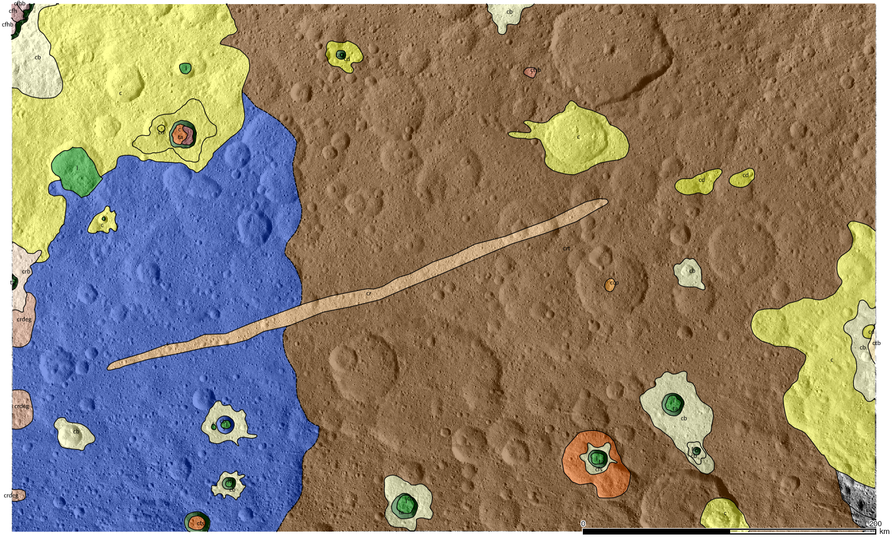

# GIS data for Ceres Ac-H-8 Nawish quadrangle geologic mapping

GIS and support data for the geologic mapping of Ceres' Nawish quadrangle Ac-H-8.

In the project file you can find the nawish_geomapping_Frigeri2018.qgs for Quantum GIS.

### Mapping basefiles

''image_mosaic.tif'' and ''dtm.tif'' located in the raster folder are the mapping base.

### Crater counts

In the data/vector/cc directory there are files useful for crater counting.

 * ''cc_areas.shp'': areas used for crater counts
 * ''cc_craters_gt4km.shp'': craters with diameters greater than 4 chilometers.

 * areas_gt4km.shp
 * 

In the data/crater_counts folder, there are the Craterstats2 file.

### Geologic Map files

 * geo_units.shp 
 * geo_contact.shp
 * geo_units_centroids.shp
 * line_feature.shp
 * point_feature.shp
 * surface_feature.shp
